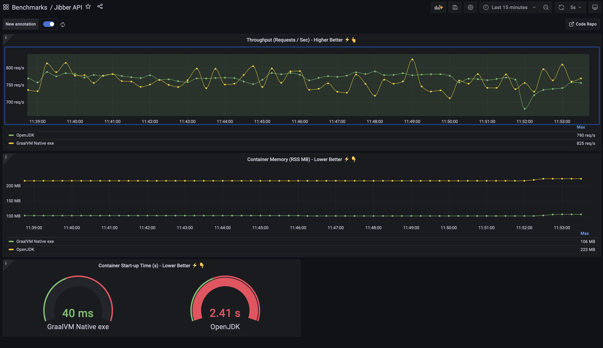
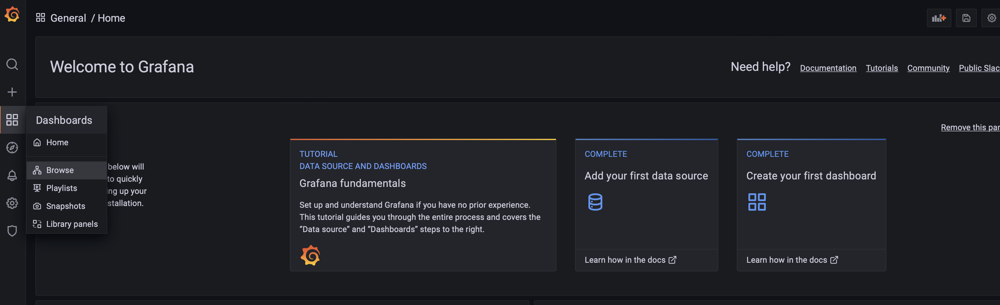
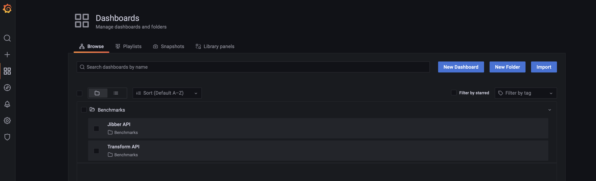

# GraalVM Native  Image Performance Demo

## Overview

The demo consists of several parts:

1. A base setup within the K8s cluster that creates:
   1. Prometheus - used for storing time series data gathered from the running instances
   2. Grafana - used to present dashboards showing the relative performance of the differing deployments
2. Individual applications that get deployed to the cluster

For each benchmark we deploy to the cluster (item 2 in the list above) we will deploy the same app in a number of 
different ways. As a Java application running on OpenJDK, as a GraalVM EE Native Image and, possibly, as a Java application running on GraalVM EE as a JVM.

The point of this is to display the varying performance profiles of the dpeloyments. 

In the end you will get a dashboard like the following image that displays real time performance data for the same application running as a GraalVM EE Native Image executable and on top of OpenJDK.



## Prerequisites

For this demo you will need the following software pre-installed. This demo can be deployed to an existing Kubernetes cluster, if you don't have a Kubernetes cluster already setup you can use the terraform to create one on OCI.

* `docker`
* Kubernetes Cluster (or use the Terraform provisioning scripts to create one on OCI)
* Linux OS - to build the images you need to be on linux. Consider running this from an OCI OL8 compute instance. TODO :: provide docker based native image builds
* `kubectl` - for deploying to your k8s cluster
* GraalVM EE 22, with the Native Image component installed
* `jq` - command line tool for querying json data. [jq website](https://stedolan.github.io/jq/)
* `envsubst` - Does shell variable substitution into files. [https://linux.die.net/man/1/envsubst](https://linux.die.net/man/1/envsubst)

Optional requirements - if you want to run the script that provisions a K8s cluster on OCI:

* OCI CLI (Command Line Interface)
* An account on OCI with access to a tenancy
* A compartment on OCI to deploy your k8s cluster and container repository to
* Terraform - [Install](https://www.terraform.io/downloads)

## Create a K8s Cluster & Container Repository on OCI

> ### If You Want to Re-Use an Existing K8s Cluster
> You might want to re-use an existing l8s cluster, in which case you don't want to apply the following 
> terraform scripts. What you will need to do is ensure that your `kubectl` is connected to your
> cluster and that you set an environment variable, `REPO_PATH`, to the value of the repository in your
> chosen Container Registry that you want to deploy the built Docker Images to. The rest of the scripts
> rely on this variable being present and correct.

These instructions will show you how to create a K8s cluster and a public container registery in a compartment on Oracle Cloud (OCI).

Create a file called, `my-variables.tf`. This will hold the details of your OCI user, region, tenancy and compartment ID within OCI that you want to create the container repository and the k8s cluster within. You won't check this in as they details are specific to you.

The following is an example - note that you will need to replace the placeholders with the actual values for each of these:

```text
variable "tenancy_ocid" {
    default = "<OCID of your tenancy here>"
}
variable "user_ocid" {
    default = "<OCID of your OCI user here>"
}
variable "compartment_ocid" {
    default = "<OCID of your compartment within the tenancy here>"
}
variable "region" {
    default = "<OCI region name here, like: us-phoenix-1>"
}
```

The above file, `my-variables.tf`, can be thought of as your connection details.

Next we will get Terraform to create everything. Run the following shell commands, fromm the root of the code repository:

```shell
# Initialise terraform for thsi project
terraform init
# Validate your config
terraform validate
# This creates everyting. NOTE: This may take 10 - 20 mins to complete
terraform apply
# Configure kubectl to talk to and manage your new k8s cluster - requires the OCI CLI 
./scripts/add-kubectl-config.sh
# Set shell environment variables that will hold the container repositry name
# NOTE : Use of '.' to add the variables to the current shell environment
. ./get-repo-path.sh
```

Let's quickly test your connectivity to the new k8s cluster:

```shell
# Query the cluster to return the namespaces
kubectl get namespaces
```

You should see something like the following:

```shell
NAME              STATUS   AGE
default           Active   10m
kube-node-lease   Active   10m
kube-public       Active   10m
kube-system       Active   10m
```

Next let's check that the conatiner repository path has been retrieved correctly:

```shell
echo $REPO_PATH 
```

This is what I saw - yours should have the same general format:

```shell
phx.ocir.io/oracledeveloper/graal-demo-repo
```

## Installation of Benchmarking Setup

You will need to ensure that the environment variable, `REPO_PATH`, is corectly set before proceeding. If you used the terraform script this will be done for you.

To deploy, this may take a little while as it is building all of the docker images for all of the benchmarks:

```shell
./scripts/deploy.sh
```

You can monitor the services (public load balancers for Prometheus and Grafana) being brough up. Run the following script to check when they have an `EXTERNAL-IP` available:

```shell
kubectl get svc -n monitoring
```

You can get the public IP endpoint (the `EXTERNAL-IP` needs to be available before you do this) for Grafana with the following scipt - allow enough time for the deployments to finish before running:

```shell
./scripts/grafana-endpoint.sh
```

You can use this to login into Grafana. Do this now. You can log in with the default user / password (`admin` / `admin`). Change the password for this immediatley - this is a public facing service.

**NOTE:** I will update the confog to generate a secure, unique password at some point soon. Until then, change the password.

If you want to see where the containers have been pushed to, you can look in the newly created container repository (if you used the terraform setup to create everything) and you should see them there.

## Open the Grafana Dashboards

You can open the dashboards that have been deployed for the benchmarks. From the Grafana web UI:

`Dashboards > Brwose > Benchmarks`


